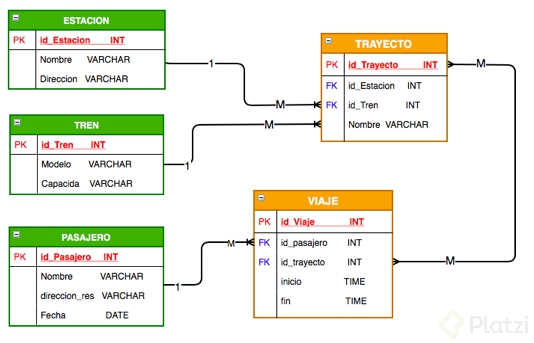
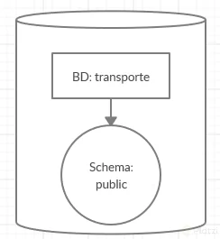

# Curso de PostgreSQL

## Archivos de configuración

Los archivos de configuración son tres principales:

- **postgreql.conf**

- **pg.hba.conf**

- **pg_ident.conf**

La ruta de los mismos depende del sistema Operarivo, para saber que que ruta estan, basta con hacer una Query

SHOW config_file;
NOTA: siempre es bueno hacer una copia original de los archivos antes de modificarlos por si movemos algo que no.

Algo a tener en cuenta es que en la ruta por default de instalación no se puede acceder debido a falta de permisos.
Para acceder a estos archivos y editarlos es necesario ser superusuario

**postgresql.conf**: Configuración general de postgres, múltiples opciones referentes a direcciones de conexión de entrada, memoria, cantidad de hilos de pocesamiento, replica, etc.

**pg_hba.conf**: Muestra los roles así como los tipos de acceso a la base de datos.

**pg_ident.conf**: Permite realizar el mapeo de usuarios. Permite definir roles a usuarios del sistema operativo donde se ejecuta postgres.

## Comandos más utilizados en PostgreSQL

La Consola

La consola en PostgreSQL es una herramienta muy potente para crear, administrar y depurar nuestra base de datos. podemos acceder a ella después de instalar PostgreSQL y haber seleccionado la opción de instalar la consola junto a la base de datos.

```sql
SELECT VERSION();

\? -- Con el cual podemos ver la lista de todos los comandos disponibles en consola, comandos que empiezan con backslash ()

-- Comandos de navegación y consulta de información

\c -- Saltar entre bases de datos

\l -- Listar base de datos disponibles

\dt -- Listar las tablas de la base de datos

\d <nombre_tabla> -- Describir una tabla

\dn -- Listar los esquemas de la base de datos actual

\df -- Listar las funciones disponibles de la base de datos actual

\dv -- Listar las vistas de la base de datos actual

\du -- Listar los usuarios y sus roles de la base de datos actual

-- Comandos de inspección y ejecución

\g -- Volver a ejecutar el comando ejecutando justo antes

\s -- Ver el historial de comandos ejecutados

\s <nombre_archivo> -- Si se quiere guardar la lista de comandos ejecutados en un archivo de texto plano

\i <nombre_archivo> -- Ejecutar los comandos desde un archivo

\e -- Permite abrir un editor de texto plano, escribir comandos y ejecutar en lote. \e abre el editor de texto, escribir allí todos los comandos, luego guardar los cambios y cerrar, al cerrar se ejecutarán todos los comandos guardados.

\ef -- Equivalente al comando anterior pero permite editar también funciones en PostgreSQL

-- Comandos para debug y optimización

\timing -- Activar / Desactivar el contador de tiempo por consulta
Comandos para cerrar la consola

\q -- Cerrar la consola

-- Ejecutando consultas en la base de datos usando la consola

CREATE DATABASE base; -- crea base de datos
CREATE TABLE tabla (columnas); -- crea tabla
INSERT INTO tabla(columna) VALUES('dato'); -- insert en tabla
SELECT * FROM tabla; -- seleccionar datos
UPDATE tabla SET cammpo = dato WHERE condicion;  -- actualizar datos
DELETE FROM tabla WHERE condicion -- borrar datos donde
```

## Tipos de datos

[Tipos de datos relevantes en Postgresql](https://www.ibiblio.org/pub/linux/docs/LuCaS/Tutoriales/NOTAS-CURSO-BBDD/notas-curso-BD/node134.html)

**Principales:**
Numéricos(Numeros enteros, Numeros Decimales, Seriales)
Monetarios(cantidad de moneda)
Texto(almacenar cadenas y texto, existen tres VARCHAR, CHAR, TEXT)
Binario(1 Y 0)
Fecha/Hora(Para almacenar Fechas y/o Horas, DATE TYPE, TIME TYPE, TIMESTAMP, INTERVAL)
Boolean(Verdadero o Falso)
Especiales propios de postgres
Geométricos: Permiten calcular distancias y áreas usando dos valores X y Y.
Direcciones de Red: Cálculos de máscara de red
Texto tipo bit: Cálculos en otros sistemas, ejm(hexadecimal, binario)
XML, JSON: Postgres no permite guardar en estos formatos
Arreglos: Vectores y Matrices

## Diseñando nuestra base de datos: estructura de las tablas



## Jerarquía de Bases de Datos

Toda jerarquía de base de datos se basa en los siguientes elementos:

- **Servidor de base de datos:** Computador que tiene un motor de base de datos instalado y en ejecución.

- **Motor de base de datos:** Software que provee un conjunto de servicios encargados de administrar una base de datos.

- **Base de datos:** Grupo de datos que pertenecen a un mismo contexto.

- **Esquemas de base de datos en PostgreSQL:** Grupo de objetos de base de datos que guarda relación entre sí (tablas, funciones, relaciones, secuencias).

- **Tablas de base de datos:** Estructura que organiza los datos en filas y columnas formando una matriz.

PostgreSQL es un motor de base de datos.

La estructura de la base de datos diseñada para el reto corresponde a los siguientes
elementos:



## Creación de Tablas

- CREATE
- ALTER
- DROP

```sql
-- create database
CREATE DATABASE transporte
    WITH
    OWNER = luis
    ENCODING = 'UTF8'
    CONNECTION LIMIT = -1;

-- create table
CREATE TABLE IF NOT EXISTS public.passenger
(
    id bigserial NOT NULL,
    name character varying(100),
    address character varying,
    birthdate date,
    CONSTRAINT passenger_pkey PRIMARY KEY (id)
);

ALTER TABLE public.passenger
    OWNER to luis;

-- insert script
INSERT INTO public.passenger(
  id, name, address, birthdate)
  VALUES (?, ?, ?, ?);
```

Obtener fecha actual

```sql
SELECT current_date;
```

### Reto

crear el resto de las tablas del diagrama

```sql
CREATE TABLE IF NOT EXISTS train(
  id bigserial NOT NULL,
  model character varying(100),
  capacity integer,
  CONSTRAINT train_pkey PRIMARY KEY (id)
);

CREATE TABLE IF NOT EXISTS station(
  id bigserial NOT NULL,
  name CHARACTER VARYING(100),
  address CHARACTER VARYING,
  CONSTRAINT station_pkey PRIMARY KEY(id)
);

-- viaje
-- CREATE TABLE IF NOT EXISTS trip(
--   id BIGSERIAL NOT NULL,
--   passenger_id INTEGER,
--   FOREIGN KEY (passenger_id) REFERENCES passenger(id),
--   CONSTRAINT trip_pkey PRIMARY KEY (id)
-- );

-- ALTER TABLE trip
--   ADD COLUMN IF NOT EXISTS start_trip date,
--   ADD COLUMN IF NOT EXISTS end_trip date;

-- fix de la tabla
CREATE TABLE IF NOT EXISTS trip(
  id BIGSERIAL NOT NULL,
  passenger_id INTEGER,
  start_trip TIME WITHOUT TIME ZONE,
  end_trip TIME WITHOUT TIME ZONE,
  FOREIGN KEY (passenger_id) REFERENCES passenger(id),
  CONSTRAINT trip_pkey PRIMARY KEY (id)
);

ALTER TABLE trip ALTER COLUMN  start_trip TYPE TIME WITHOUT TIME ZONE,
ALTER COLUMN end_trip TYPE TIME WITHOUT TIME ZONE;

-- trayecto
CREATE TABLE IF NOT EXISTS journey(
  id BIGSERIAL NOT NULL,
  name CHARACTER VARYING(100),
  station_id INTEGER,
  train_id INTEGER,
  FOREIGN KEY (station_id) REFERENCES station(id),
  FOREIGN KEY (train_id) REFERENCES train(id),
  CONSTRAINT journey_pkey PRIMARY KEY (id)
);

-- journey & trip many to many relationship
CREATE TABLE IF NOT EXISTS journey__trip__relation(
  id BIGSERIAL NOT NULL,
  journey_id INTEGER,
  trip_id INTEGER,
  FOREIGN KEY (journey_id) REFERENCES journey(id),
  FOREIGN KEY (trip_id) REFERENCES trip(id),
  CONSTRAINT journey__trip__relation_pkey PRIMARY KEY (id)
);

```

## Particiones

- separacion fisica de datos
- Estructura logica

Cuando una tabla tiene cientos de miles de datos hacer consultas entre rangos requieren un alto consumo del computo del CPU

por ello al particionar la tabla se segmenta la ubicacion de los datos de forma fisica en el disco, manteniendo las propiedades logicas a la hora de realizacion de consultas

```sql
-- tabla de bitacora de viaje

CREATE TABLE IF NOT EXISTS public.trip_log
(
    id bigint NOT NULL DEFAULT nextval('trip_log_id_seq'::regclass),
    id_trip integer,
    date date
) PARTITION BY RANGE (date);

ALTER TABLE public.trip_log
    OWNER to luis;

-- se crea una particion para enero de 2010
-- para poder insertar valores en ese rango de fechas
CREATE TABLE trip_log_2010_01 PARTITION OF trip_log
FOR VALUES FROM ('2010-01-01') TO ('2010-01-31');

-- se inserta un valor que se encuentra entre el rango de fecha
INSERT INTO public.trip_log(
  id_trip, date)
  VALUES (1, '2010-01-01');

-- de esta forma permite realizar consultas de forma normal
SELECT * FROM trip_log;
```

Otra de las ventajas de las tablas particionadas es que puedes utilizar la sentencia TRUNCATE, la cual elimina toda la información de una tabla, pero a nivel partición. Es decir, si tienes una tabla con 12 particiones (1 para cada mes del año) y deseas eliminar toda la información del mes de Enero; con la sentencia ALTER TABLE tabla TRUNCATE PARTITION enero; podrías eliminar dicha información sin afectar el resto.

al usar las tablas particionadas no hace falta declarar el id como primary key ya que las llaves primarias que utilizara Postgresql son
la columnas utilizadas para paticionar, en esta caso la fecha

## Creación de Roles

Los roles se asignan a los usuarios y poseen multiples funciones

- Crear y eleminar (incluso otros roles)
- Asginar atributos
- Agrupar con otros Roles
- Roles predeterminados

Lo ideal en un servidor seria tener un rol para la creacion y borrado de base de datos y tablas, y un rol para la consulta y borrado de datos dentro de una tabla

```sql
postgres=# \h CREATE ROLE
Command:     CREATE ROLE
Description: define a new database role
Syntax:
CREATE ROLE name [ [ WITH ] option [ ... ] ]

where option can be:

      SUPERUSER | NOSUPERUSER
    | CREATEDB | NOCREATEDB
    | CREATEROLE | NOCREATEROLE
    | INHERIT | NOINHERIT
    | LOGIN | NOLOGIN
    | REPLICATION | NOREPLICATION
    | BYPASSRLS | NOBYPASSRLS
    | CONNECTION LIMIT connlimit
    | [ ENCRYPTED ] PASSWORD 'password' | PASSWORD NULL
    | VALID UNTIL 'timestamp'
    | IN ROLE role_name [, ...]
    | IN GROUP role_name [, ...]
    | ROLE role_name [, ...]
    | ADMIN role_name [, ...]
    | USER role_name [, ...]
    | SYSID uid

URL: https://www.postgresql.org/docs/13/sql-createrole.html
```

Despues de la version 9.3 de Postgresql ROLE y USER son lo mismo

```sql
CREATE ROLE usuario_consulta;
```

listar los roles

```sql
\dg
```

modificar un rol

```sql
-- agregandole la capacidad de hacer login
ALTER ROLE usuario_consulta WITH LOGIN;

-- agregando superuser
ALTER ROLE usuario_consulta WITH SUPERUSER;

-- Agregando contraseña
ALTER ROLE usuario_consulta WITH PASSWORD 'etc123';
```

borrando roles

```sql
DROP ROLE usuario_consulta;
```

Dandole permisos de consulta a un usuario en un tabla

```sql
GRANT INSERT, SELECT, UPDATE, DELETE ON TABLE trip TO usuario_consulta;
```

## Llaves foráneas

Creacion de una realación foranea

```sql
CREATE TABLE IF NOT EXISTS public.trayecto
(
    id bigserial,
    train_id integer,
    PRIMARY KEY (id),
    CONSTRAINT trayecto_train_fkey FOREIGN KEY (train_id)
        REFERENCES public.train (id) MATCH SIMPLE
        ON UPDATE CASCADE
        ON DELETE CASCADE
        NOT VALID
);

ALTER TABLE public.trayecto
    OWNER to luis;
```

Agregar un constrain

```sql
ALTER TABLE trip
  ADD CONSTRAINT trip_passenger_id_fkey FOREIGN KEY (passenger_id)
    REFERENCES passenger (id) MATCH SIMPLE
    ON UPDATE CASCADE
    ON DELETE CASCADE;
```

Para actualizar un constrain primero se debe hacer drop del constrain anterior y luego se vuelve a crear

```sql
ALTER TABLE trip
  DROP CONSTRAINT trip_passenger_id_fkey;

ALTER TABLE trip
  ADD CONSTRAINT trip_passenger_id_fkey
    FOREIGN KEY (passenger_id)
    REFERENCES passenger (id) MATCH SIMPLE
    ON UPDATE CASCADE
    ON DELETE CASCADE;
```

tabla journey__trip__relation

```sql
ALTER TABLE journey__trip__relation
  DROP CONSTRAINT journey__trip__relation_journey_id_fkey,
  DROP CONSTRAINT journey__trip__relation_trip_id_fkey;

ALTER TABLE journey__trip__relation
  ADD CONSTRAINT journey__trip__relation_journey_id_fkey
    FOREIGN KEY (journey_id)
    REFERENCES journey (id) MATCH SIMPLE
    ON UPDATE CASCADE
    ON DELETE CASCADE,
  ADD CONSTRAINT journey__trip__relation_trip_id_fkey
    FOREIGN KEY (trip_id)
    REFERENCES trip (id) MATCH SIMPLE
    ON UPDATE CASCADE
    ON DELETE CASCADE;
```

## Inserción y consulta de datos

Insert de datos

```SQL
-- insertando valores en estacion
INSERT INTO station(
  name, address)
  VALUES (?, ?);

INSERT INTO public.station(
  name, address)
  VALUES ('Estacion Norte', 'St #203');

-- insertando valores en trenes
INSERT INTO train(
  model, capacity)
  VALUES (?, ?);

INSERT INTO public.train(
  model, capacity)
  VALUES ('Frances 3004', 100);

-- insert trayecto
INSERT INTO public.journey(
  name, station_id, train_id)
  VALUES ('Centro Maracaibo', 1, 1);
```

Cambiando el id

```sql
UPDATE public.train
  SET id=1
  WHERE id = 2;
```

Con los CONSTRAINTS en cascada al cambiar el id de un registro este tambien cambia en los datos que lo referencian

y al borrar un registro tambien se borran los registros en otras tablas que lo referencian

### Otras notas

Hay una situación importante sobre las claves foráneas (FK) que se explica en esta clase y me gustaría resaltarla un poco mas:
Primeramente recordar del curso de Fundamentos de BD que a las tablas se les llama “independientes” cuando no tienen FK’s. Del mismo modo una tabla es “dependiente” cuando tiene al menos una FK, es decir, son tablas que dependen de tablas independientes.
Es importante **al momento de crear tablas e insertar datos en ellas** , empezar siempre por las tablas independientes y una vez terminadas seguir con las dependientes

## Inserción masiva de datos

Herramienta para crear data falsa para hacer test de forma masiva
[mockaroo](https://mockaroo.com/)

## Cruzar tablas: SQL JOIN

Tipos de Join

- JOIN (INNER)
- LEFT [OUTER]
- RIGT [OUTER]
- FULL OUTER

```SQL
-- pasajeros que han tomado al menos un viaje
SELECT * FROM passenger
JOIN trip ON (trip.passenger_id = passenger.id);


-- ver los pasajeros que no tienen ningun viaje
SELECT * FROM passenger
LEFT JOIN trip ON (trip.passenger_id = passenger.id)
WHERE trip.id IS NULL;
```

## Funciones Especiales Principales

- ON CONFLICT DO
Realizar accion en caso de conflicto al insertar un dato que ya existe

- RETURNING
de hacer un insert devuelve los datos que acaban de ser insertados

- LIKE / ILIKE
Permite busquedas de String por similitud

- IS / IS NOT
Comparaciones de tipos de datos

```sql
-- hacer nada en un conflicto
INSERT INTO public.station(
  id, name, address)
  VALUES (1, 'Nombre', 'Avenida Don Julio Centeno')
  ON CONFLICT DO NOTHING;

-- actualizar de haber conflicto
INSERT INTO public.station(
  id, name, address)
  VALUES (1, 'Nombre', 'Avenida Don Julio Centeno')
  ON CONFLICT(id) DO UPDATE SET name = 'Nombre', address= 'Adress';

-- retorna todo lo que se inserto
INSERT INTO public.station(
  name, address)
  VALUES ('Lorem DOLOR Nombre', 'Avenida Don Julio Centeno')
RETURNING *;
```

LIKE / ILIKE

```SQL
-- % (porcentaje) es un comodin que se reemplaza por cualquiere valor
SELECT name
  FROM public.passenger
  WHERE name LIKE 'o%';

-- la diferencia en LIKE y ILIKE es que LIKE considera la diferencia entre mayusculas y minusculas
-- mientras que ILIKE puede ser cualquiera
SELECT name
  FROM public.passenger
  WHERE name ILIKE 'o%';
```

IS / IS NOT

```SQL
-- Ya que el valor null no es estandar la comparacion de si el valor es nulo es con IS
SELECT *
  FROM public.train
  WHERE model IS NULL;
```

## Funciones Especiales Avanzadas

- COALESCE
Verifica entre dos parametros cual es nulo y retorna el que no es null

- NULLIF
Compara si dos campos son iguales y retorna null si es cierto

- GREATEST
retorna el valor mas grande de una lista

- LEAST
retorna el valor mas pequeño de una lista

- BLOQUES ANONIMOS
Permite construir condicionales como un campo

```sql
-- si el nombre es nulo retorna 'No aplica'
SELECT id, COALESCE(name, 'No aplica') as name, address, birthdate
  FROM public.passenger WHERE id = 1;

-- retornara null
SELECT NULLIF(0,0)

```

bloque CASE

```sql
SELECT id, name, address, birthdate,
CASE
WHEN birthdate > '1999-01-01' THEN
'Gen Z'
ELSE
'Millennials'
END
  FROM public.passenger;
```

## Vistas

Existen dos tipos de vistas

- Vistas Volatiles: Volatil
la vista volatil siempre ejecuta la consulta de nuevo con los datos de la base de datos

- Vistas Materializada: Persistente
La vista materializada ejecuta la consulta una vez y guarda los resultados en memoria, esto tiene la desventaja de que si no se actualiza la vista materializada pueden ser datos viejos los que se consulten.

En escencia es tomar una consulta y transformarla en una unica palabra

vista volatil

```sql
-- vista volatil
CREATE OR REPLACE VIEW public.passenger_generations
 AS
SELECT id, name, address, birthdate,
CASE
WHEN birthdate > '1999-01-01' THEN
'Gen Z'
ELSE
'Millennials'
END
  FROM passenger;

ALTER TABLE public.passenger_generations
    OWNER TO luis;
```

Vista materializada

```sql
CREATE MATERIALIZED VIEW public.trips_post_noon_mview
AS
SELECT * FROM trip WHERE start_trip > '15:00:00'
WITH NO DATA;

ALTER TABLE public.trips_post_noon_mview
    OWNER TO luis;
```

Refrescar la vista materializada

```sql
REFRESH MATERIALIZED VIEW trips_post_noon_mview;
```

Aunque se borren los datos si la vista materializada no se actuliza esta seguira mostrando los datos que se guardaron previamente, incluso si algunos se llegaron a borrar

```sql
DELETE FROM journey__trip__relation WHERE trip_id = 6;

DELETE FROM trip WHERE id = 6;

SELECT * FROM trips_post_noon_mview;
```

### Notas alumnos

Agarra una consulta que se realice muchas veces y colocarla bajo un solo nombre.
Centraliza muchos esfuerzos en una sola función.
Vista volátil: Siempre que se haga la consulta en la vista, la BD hace la ejecución de la consulta en la BD, por lo que siempre se va a tener información reciente.
Vista materializada: Hace la consulta una sola vez, y la información queda almacenada en memoria, la siguiente vez que se consulte, trae el dato almacenado, eso es bueno y malo a la vez, bueno porque la velocidad con la que se entrega la información es rápida, malo porque la información no es actualizada. Es ideal utilizar este tipo de vista en procesos que utilice días anteriores, porque el día de ayer, ya pasó y no hay razón para actualizarlo.
Para crear una vista volátil en postgres, damos click derecho a views, create, view, le damos un nombre, y en la pestaña code escribimos o pegamos el código de la consulta que queremos guardar, la guardamos y para usar la vista usamos:

```sql
SELECT * FROM <nombre_vista>; y listo.
```

Para crear una vista materializada, primero creamos la consulta, y definimos si los datos nos interesan o no, luego, vamos a la opción materialized views, click derecho, create, materialized view. Se abre la ventana, le damos un nombre, termina con _mview, y en la pestaña Definition escribimos la consulta que necesitamos guardar. Guardamos.
Al probarla en este momento nos lanza un error, ¿por qué? porque no tiene datos almacenados. Para almacenar datos usamos:

```sql
REFRESH MATERIALIZED VIEW <nombre vista>;
```

Y ahora si podemos consultarla:

```sql
SELECT * FROM <nombre_vista_mview>;
```

## PL/SQL

Procedural Language

Permite utilizar codigo directamente dentro de la base de datos

Se usa la palabra reservada DO para iniciar una PL

y el uso de \$\$ pra abrir y cerrar el bloque de la funcion

```sql
$$ $$
```

Ejemplo

```sql
-- DO para el PL
-- $$ para el abir y cierre del pl
-- BEGIN y END para declarar que es un
-- bloque de codigo lo que se esta usando
DO $$
BEGIN
  RAISE NOTICE 'ALGO ESTA PASANDO';
END
$$
```

Recorrer una tabla con una PL

```sql
-- DO para el PL
-- $$ para el abir y cierre del pl
-- BEGIN y END para declarar que es un
-- bloque de codigo lo que se esta usando
DO $$
-- DECLARE para declarar variables
-- el tipo de dato de una fila es record
-- asignar valores en PL es con :=
DECLARE
  rec record;
BEGIN
  FOR rec IN SELECT * FROM passenger LOOP
    RAISE NOTICE 'UN Pasajero se llama %', rec.name;
    -- rec.address
    -- rec.id
  END LOOP;
END
$$
```

Conteo de filas

```sql
DO $$
DECLARE
  rec record;
  contador integer := 0;
BEGIN
  FOR rec IN SELECT * FROM passenger LOOP
    -- RAISE NOTICE 'UN Pasajero se llama %', rec.name;
    contador := contador + 1;
  END LOOP;
  RAISE NOTICE 'Conteo es %', contador;
END
$$
```

Creando una funcion

```sql
CREATE FUNCTION importantePL()
 RETURNS void
AS $$
-- DECLARE para declarar variables
-- el tipo de dato de una fila es record
-- asignar valores en PL es con :=
DECLARE
  rec record;
  contador integer := 0;
BEGIN
  FOR rec IN SELECT * FROM passenger LOOP
    -- RAISE NOTICE 'UN Pasajero se llama %', rec.name;
    contador := contador + 1;
  END LOOP;
  RAISE NOTICE 'Conteo es %', contador;
END
$$
LANGUAGE 'plpgsql';
```

Llamando la función

```sql
SELECT importantePL();
```

Retornando un valor con la funcion

```sql
-- al cambiar el tipo de retorno de la funcion es necesario primero hacer DROP de esta funcion
DROP FUNCTION importantepl();
CREATE OR REPLACE FUNCTION importantePL()
 RETURNS integer
AS $$
-- DECLARE para declarar variables
-- el tipo de dato de una fila es record
-- asignar valores en PL es con :=
DECLARE
  rec record;
  contador integer := 0;
BEGIN
  FOR rec IN SELECT * FROM passenger LOOP
    -- RAISE NOTICE 'UN Pasajero se llama %', rec.name;
    contador := contador + 1;
  END LOOP;
  RAISE NOTICE 'Conteo es %', contador;
  RETURN contador;
END
$$
LANGUAGE 'plpgsql';

SELECT importantePL();
```

Creado con Pg Admin
El texto dentro de los \$\$ es indiferente y es mas un estandar para entender que es un bloque de codigo

```sql
CREATE FUNCTION public."importantePL"()
  RETURNS integer
  LANGUAGE 'plpgsql'
AS $BODY$
DECLARE
  rec record;
  contador integer := 0;
BEGIN
  FOR rec IN SELECT * FROM passenger LOOP
    contador := contador + 1;
  END LOOP;
  RAISE NOTICE 'Conteo es %', contador;
  RETURN contador;
END
$BODY$;
```

Pg Admin agrega comillas porque se estan usando mayusculas en el nombre

```sql
ALTER FUNCTION public."importantePL"()
  RENAME TO impl;
```

## Triggers

Triggers o Disparadores

Son acciones que se ejecutan cuando ocurren Acciones dentro de una tabla

A las acciones a las cuales se les puede asignar un Trigger son:

- Insert
- Update
- Delete

Creando tabla de los conteos de la tabla de pasajeros

```sql
CREATE TABLE IF NOT EXISTS public.passenger_count
(
    total integer,
    "time" time with time zone,
    id bigserial,
    PRIMARY KEY (id)
);

ALTER TABLE public.passenger_count
    OWNER to luis;
```

Actualizando la funcion para hacer un insercion

```sql
CREATE OR REPLACE FUNCTION public.impl()
    RETURNS integer
    LANGUAGE 'plpgsql'
    COST 100
    VOLATILE PARALLEL UNSAFE
AS $BODY$
DECLARE
  rec record;
  contador integer := 0;
BEGIN
  FOR rec IN SELECT * FROM passenger LOOP
    contador := contador + 1;
  END LOOP;
  RAISE NOTICE 'Conteo es %', contador;
  
  -- insertando valor
  INSERT INTO passenger_count (total, time)
  VALUES (contador, now());
  
  RETURN contador;
END
$BODY$;
```

Cambiando la funcion a un Trigger

```sql
DROP FUNCTION impl();

CREATE OR REPLACE FUNCTION public.impl()
    RETURNS TRIGGER
    LANGUAGE 'plpgsql'
    COST 100
    VOLATILE PARALLEL UNSAFE
AS $BODY$
DECLARE
  rec record;
  contador integer := 0;
BEGIN
  FOR rec IN SELECT * FROM passenger LOOP
    contador := contador + 1;
  END LOOP;

  -- insertando valor
  INSERT INTO passenger_count (total, time)
  VALUES (contador, now());
END
$BODY$;
```

Creando un trigger

```sql
CREATE TRIGGER mytrigger
-- BEFORE
-- INSTEAD OF
AFTER INSERT -- UPDATE , DELETE
ON passenger
FOR EACH ROW
EXECUTE PROCEDURE impl();
```

Acomando el ciclo de ejecucion de la trigger function

```sql
CREATE OR REPLACE FUNCTION public.impl()
    RETURNS trigger
    LANGUAGE 'plpgsql'
    COST 100
    VOLATILE NOT LEAKPROOF
AS $BODY$
DECLARE
  rec record;
  contador integer := 0;
BEGIN
  FOR rec IN SELECT * FROM passenger LOOP
    contador := contador + 1;
  END LOOP;
  
  -- insertando valor
  INSERT INTO passenger_count (total, time)
  VALUES (contador, now());
  
  -- Los triggers tienen variables globales muy importantes
  -- OLD es lo que estaba antes del cambio
  -- NEW es lo que hay despues el cambio
  -- Si retornamos NEW es decir que el cambio procede
  -- Si retornamos OLD es decir que mantenga lo anterior y no ejecute el cambio
  -- En un insert OLD no posee ningun valor
  RETURN NEW;
END
$BODY$;
```

Trigger on DELETE

```sql
CREATE TRIGGER mytrigger2
    AFTER DELETE
    ON public.passenger
    FOR EACH ROW
    EXECUTE FUNCTION public.impl();
```

## Simulando una conexión a Bases de Datos remotas

Obtener datos de hosts remotos

dblink

Primero debe verificarse que dblink esta instalado ya que es una extension de postgres y no viene por defecto

Crear la extension dblink que postgres incluye pero no instala por defecto, esta extension debe crearse por cada base de datos individual

```sql
CREATE EXTENSION dblink;
```

```sql

-- se deberian dejar espacio despues de cada instruccion ya que  son comandos diferentes
SELECT * FROM
dblink('dbname=remota 
  port=5432 
  host=127.0.0.1 
  user=xxxx 
  password=xxxx',
  'SELECT id, fecha FROM vip;')
  AS datos_remotos(id integer, "date" date);

A la query se le debe dar el formato de como llegaran los datos
```

Haciendo cruce de datos con una tabla local

```sql
SELECT * FROM passenger
JOIN 
dblink('dbname=remota 
  port=5432 
  host=127.0.0.1 
  user=xxxx 
  password=xxxxxxx',
'SELECT id, date FROM vip;')
AS datos_remotos(id integer, "date" date)
ON (passenger.id = datos_remotos.id);
```

Ya que ambas tablas se cruzan por la columna id, el JOIN se puede hacer con `USING(id)`

```sql
SELECT * FROM passenger
JOIN 
dblink('dbname=remota 
  port=5432 
  host=127.0.0.1 
  user=xxxx 
  password=xxxxxxx',
'SELECT id, date FROM vip;')
AS datos_remotos(id integer, "date" date)
USING(id);
```

Al usar usign id el query retorna solo una columna de id en lugar de ambas columnas lo cual haria si se usara un `ON` para realizar el JOIN

### Reto

query a la tabla de pasageros desde la tabla remota

```sql
-- CREATE EXTENSION dblink;
SELECT * FROM vip
JOIN 
dblink('dbname=transporte 
  port=5432 
  host=127.0.0.1 
  user=xxxxxxx 
  password=xxxxxxxxxxxx',
'SELECT id, name, address, birthdate FROM passenger;')
AS remote_passenger(id INTEGER, name CHARACTER VARYING, address CHARACTER VARYING, birthdate DATE)
USING(id);
```

## Transacciones

Permite ejecutar una serie de acciones y si alguna falla se retornan los cambios

```sql
BEGIN
<consultas>
COMMIT | ROLLBACK
```

COMMIT: ejecuta los cambios y los mantiene

ROLLBACK: regresa los cambios y deja el estado anterior de los datos

Si se esta trabajando en **pgadmin** , desactivar la opcion de **auto commit**

```sql
BEGIN;
SELECT true;
```

de estar en pgadmin mostraria dos botones , de commit y rollback, ya que detecta que estas haciendo una transaccion

```SQL
BEGIN;
SELECT true;

SELECT NOW();
```

Insert como una transaccion

```sql
BEGIN;
INSERT INTO public.station(
  name, address)
  VALUES ('Transaccion', 'Direccion 2');
INSERT INTO public.train(
  model, capacity)
  VALUES ('modelo transaccion', 2893);
```

para concluir con la transaccion se ejecuta un COMMIT

```SQL
COMMIT;
```

Si una transaccion tiene multiples acciones y una falla se retornan todas, en este caso el primer insert no se mantiene porque el segundo falla

```sql
BEGIN;

INSERT INTO public.train(
  model, capacity)
  VALUES ('modelo transacciooooon', 2893);
INSERT INTO public.station(
  id, name, address)
  VALUES (108, 'Transaccion', 'Direccion 2');

COMMIT;
```

ROLLBACK no suele ser usado en transacciones tan explicitas como insert

En ciertos casos en los cuales usar ROLLBACK , puede ser para:

- mantener un maximo de registros en una tabla, con una condicion que se comprueba justo antes del rollback
- deshacer un DELETE

Internamente POSTGRESQL usa ROLLBACK para todas las operaciones SQL que fallen

[Como trabajar con transacciones en PostgreSQL](https://www.enterprisedb.com/postgres-tutorials/how-work-postgresql-transactions)

## Otras Extensiones para Postgres

Postgresql tiene multiples Extensiones instaladas, pero no estan activadas por defecto

[Extensiones existentes en postgres](https://www.postgresql.org/docs/13/contrib.html)

### Funciones fuzzystrmatch

levenshtein

Encontrar la diferencia entre dos palabras

Es basada en una formula matematica hecha por un matematico Ruso

```sql
CREATE EXTENSION fuzzystrmatch;

-- Retorna la cantidad de letras que hay que cambiar para que ambas palabras sean iguales
SELECT levenshtein('Luis', 'Louis');
```

difference

Retorna un valor entre 0 y 4 , al comparar la pronunciacion de dos palabras en ingles , 0 es que no se parecen en pronunciacion y 4 es que son practicamente iguales al pronunciarce

Es mucho mas compleja internamente ya que usa Machine Learning para comparar el sonido de las palabras al pronunciarse en ingles

```sql
SELECT difference ('oswaldo', 'osvaldo');

SELECT difference ('beard', 'bird');

SELECT difference ('Luis', 'Lous');
```

## Backups y Restauración

pg_dumb y pg_restore
[psql]

Los **Blobs** son los datos binarios como imagenes, videos o archivos de texto

Se recomienda no guardar información multimedia en la base de datos

Comando de pg_dumb generado por pgadmin

```sh
/usr/bin/pg_dump --file "/home/luis/Documents/courses/platzi-postgresql/copia.sql" --host "localhost" --port "5432" --username "luis" --no-password --verbose --format=c --blobs "transporte"
```

PgAdmin por defecto genera los backups en tipo custom para optimizar el proceso, la desventaja es que este tipo de archivo solo puede ser leido por pgadmin o postgresql

El tipo de backup plain se genera en un conjunto de instrucciones sql que deben ser ejecutadas

Comando de pg_restore generado por pgadmin

```sh
/usr/bin/pg_restore --host "localhost" --port "5432" --username "luis" --no-password --dbname "transporte2" --verbose "/home/luis/Documents/courses/platzi-postgresql/copia.sql"
```

## Mantenimiento

Postgresql de forma automatica hace cierto nivel de mantenimiento como borrar las tablas y filas que estan vacias o no se usan

El mantenimiento se puede hacer por base de datos o por tablas, mientras se hace mantenimiento a una tabla esta queda bloqueada y al hacer mantenimiento a una base de datos, todas las tablas quedan bloqueadas.

Opciones de mantenimiento

### VACUUM

Se refiere a un vaciado
La tabla queda limpia en su totalidad borrando todas las filas e indices que ya no son aplicables

Si la limpieza duro mas que el tiempo que toma una nueva consulta en llegar, la tabla se bloqueara lo que significa que ningun nuevo proceso podra acceder a ella

Puede ser

- FULL

Activarlo o desactivarlo puede tumbar la base de datos

- FREEZE

Se indica que congele la tabla hasta que termine la limpieza

- ANALYZE

Ejecuta un revision sin cambiar nada en la tabla y retorna informacion del estado actual de la tabla

### ANALYZE

No hace ningun cambio, solo ejecuta un revision en la tabla

### REINDEX

Aplica para tablas con indices eso incluye las llaves primarias

El reindice es importante pues en tablas MUY grandes puede ocurrir que el indice es mas grande que la misma tabla

### CLUSTER

Es decirle al motor de base datos que reorganice la informacion en disco

### Tips

Lo mejor es dejar que POSTGRESQL haga el mantenimiento por su cuenta la mayoria del tiempo, en caso de que verdadera se vea un deficit en la base de datos y haga falta un mantenimiento es imperativo hacerlo en un horario que no afecte el sistema que utiliza la base de datos.

## Introducción a Réplicas

Son mecanismos que nos permiten evitar problemas de entrada y salida en los sitemas operativos

Si la aplicacion crece de forma exponencial te encontraras con problemas de fisica y electronica pues puede que quieras ejecutar acciones a una velocidad mayor de la que permite el hardware

POSTGRESQL bloquea una tabla mientras se modifica para que no la puedas leer , y mientras la lees para que no la puedas modificar

en el caso que tengas miles de queries por segundo una peticion de datos puede tomar minutos si tiene que esperar a todas las demas

**Siempre piensa en modo replica**
Tener replicas es tener una base de datos de escritura y una de solo lectura y Postgresql se encarga de sincronizar los datos cada cierto tiempo

Para lograrlo se deben tener multiples servidores de Postgresql uno como **master** y el otro como **slave/replica**

## Implementación de Réplicas en Postgres